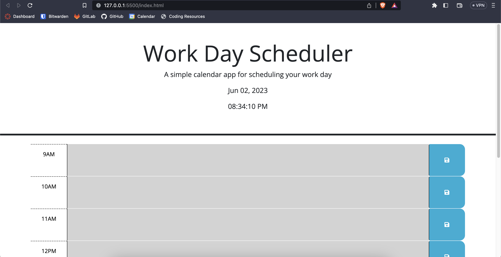
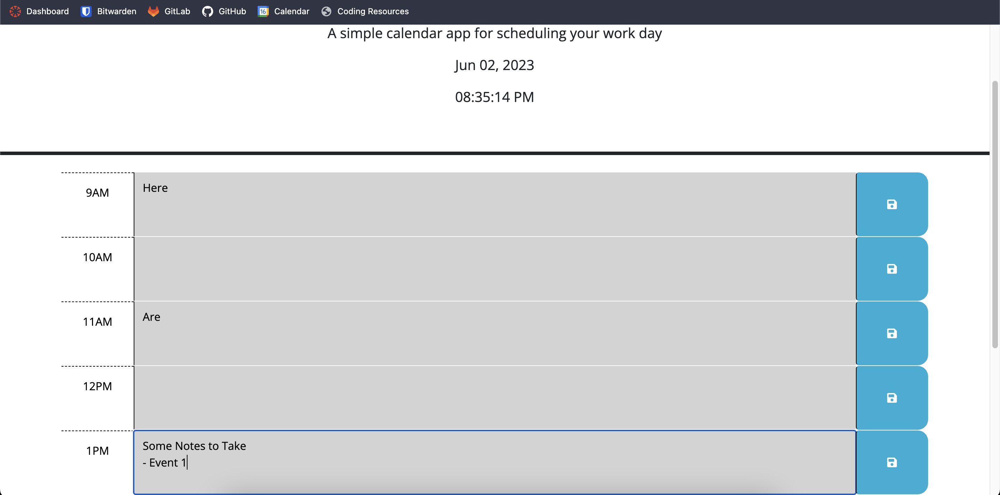
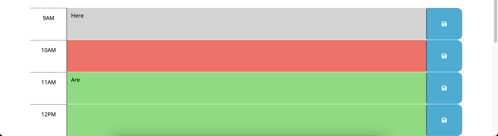
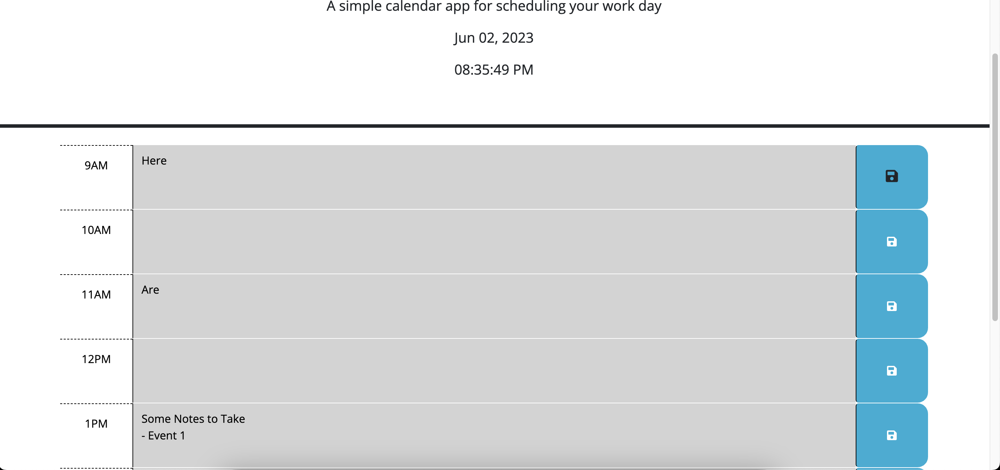

# Work Day Calendar Planner (UCSD Challenge 5)

## Description

Provide a short description explaining the what, why, and how of your project. Use the following questions as a guide:

- A simple calendar application with DayJS used for timekeeping.
- You're able to check the current hour, along with the day, and make notes for past, present, and future.
- Using localStorage, you can save your messages for later use/ reference. 

## Installation

No installation is necessary. Access via [Gitpages](epicasino.github.io/Calendar-App/).

## Usage

Provide instructions and examples for use. Include screenshots as needed.

To add a screenshot, create an `assets/images` folder in your repository and upload your screenshot to it. Then, using the relative filepath, add it to your README using the following syntax:

**Upon first visiting the site, you will be presented with the current time and date, along with time-blocks for a normal 9AM - 5PM work schedule.**

**As you use the website, the current time is updated in real time. You may take notes on any code block, whether it would be in your current hour or not.**
*The current hour will be shaded in red. Future times will be shaded in green, and past hours will be shaded in grey.*

**After making notes, you may click the save icon to the right of the desired time-block you would like to save. NOTE: Using the save button will only affect the same time-block you clicked the button in. In order to save multiple times-blocks, you will need to press each save button per text-box.**

**After refreshing with some saved text, you will still have access to these saved notes for future use.**

## License

MIT License

Copyright (c) 2023 Ray Badua

Permission is hereby granted, free of charge, to any person obtaining a copy
of this software and associated documentation files (the "Software"), to deal
in the Software without restriction, including without limitation the rights
to use, copy, modify, merge, publish, distribute, sublicense, and/or sell
copies of the Software, and to permit persons to whom the Software is
furnished to do so, subject to the following conditions:

The above copyright notice and this permission notice shall be included in all
copies or substantial portions of the Software.

THE SOFTWARE IS PROVIDED "AS IS", WITHOUT WARRANTY OF ANY KIND, EXPRESS OR
IMPLIED, INCLUDING BUT NOT LIMITED TO THE WARRANTIES OF MERCHANTABILITY,
FITNESS FOR A PARTICULAR PURPOSE AND NONINFRINGEMENT. IN NO EVENT SHALL THE
AUTHORS OR COPYRIGHT HOLDERS BE LIABLE FOR ANY CLAIM, DAMAGES OR OTHER
LIABILITY, WHETHER IN AN ACTION OF CONTRACT, TORT OR OTHERWISE, ARISING FROM,
OUT OF OR IN CONNECTION WITH THE SOFTWARE OR THE USE OR OTHER DEALINGS IN THE
SOFTWARE.